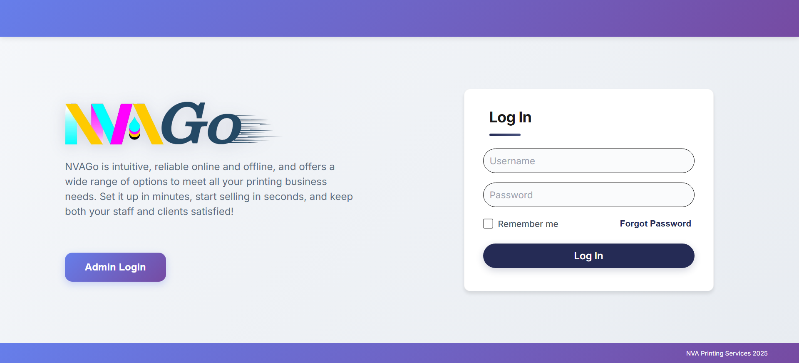

# NVAGo - Online Ordering and POS System

A mobile and web-based ordering system for NVA Printing Services that allows customers to order printing services online and enables staff to manage orders efficiently.



## Table of Contents:
- [About](#About)
- [Features](#Features)
- [Technology Used](#Technology-Used)
- [Installation](#Installation)
- [Contributors](#Contributors)
- [Contact](#Contact)


## About
NVAGo was developed as a 4th-year BS Information Technology Capstone Project with the goal of helping traditional printing businesses transition to a digital demand and customer-centric service model.
The system reflects modern software development practices and aims to serve as both an academic contribution and a real-world business solution.

NVAGo is a dual-platform solution designed for NVA Printing Services to digitalize the printing service workflow.
The system consists of:

- A **Mobile Application** for customers to place orders, upload design files, and track transactions conveniently through their smartphones.
- A **Web-based POS System** for staff to manage orders, customers, and operations efficiently.

NVAGo aims to reduce manual steps, improve communication between customers and staff, automate service pricing and order tracking, and support faster, more reliable transactions.

## Features

**Customer — Mobile Application:**
- Browse and order printing services
- Upload design files
- Chat with designers
- Pay with GCash
- Track order status
- Download receipts

**Staff — Web-based POS:**
- View and manage customer orders
- Validate payments
- Update order status
- Chat with customers
- Generate reports

**Admins - Web-based:**
- Manage users and products
- Monitor system activity
- Update pricing and services

## Technology Used

- **Mobile Application:**
    Developed using **React Native with Expo (Android)** to provide customers with a smooth ordering experience, file upload capability, and real-time order tracking directly through their smartphones.
  
- **Web Interface:**
    Built using React for the staff/admin dashboard, enabling efficient order management, customer monitoring, proof of payment validation, sales reporting, and communication.

- **Database:**
    **PostgreSQL (Supabase)** is used for centralized data storage, handling customer information, orders, payments, system logs, and real-time synchronization between the mobile app and the staff dashboard.
  
- **Payment Handling:**
    The system does not include direct **GCash API integration** yet. Instead, the customer uploads a GCash Proof of Payment (such as a screenshot) after checkout. The uploaded proof is processed through the system’s **Proof of Payment Gateway** and awaits manual verification by the employee before marking the payment as successful.
    This approach ensures secure record-tracking while allowing flexibility for future full mobile wallet integration.

- **Hosting & Backend Services:**
    Supabase is used for backend services including database hosting, authentication, file storage (design uploads and GCash proof), and API interaction—providing a scalable backend infrastructure without needing a dedicated server.

## Installation

### Clone Repository

Download the project code to your local machine:

```bash
git clone https://github.com/kroue/nva-go.git
cd nva-go
```

### Install Dependencies

Install all required packages and libraries for the project:

```bash
npm install
```

or if you're using yarn:

```bash
yarn install
```

### Setup Environment Variables

Create a `.env` file in the root directory with your Supabase credentials:

```
SUPABASE_URL=your_supabase_url
SUPABASE_ANON_KEY=your_supabase_key
```

### Run the Application
Open the Integrated terminal first.

**For web interface:** 
```bash
npm run web
```

**For mobile app:**
```bash
npx expo start
```

Then scan the QR code with Expo Go app on your Android device.

## Contributors

- **Kriz Marie P. Cultura**- System Analyst
- **Ariana Marie O. Palle**- Front-End Developer
- **Aljohn B. Arranguez**- Back-End Developer / Database Administrator
- **Rodel T. Madrid**- Technical Writer

## Contact

Repository: [github.com/kroue/nva-go](https://github.com/kroue/nva-go)
